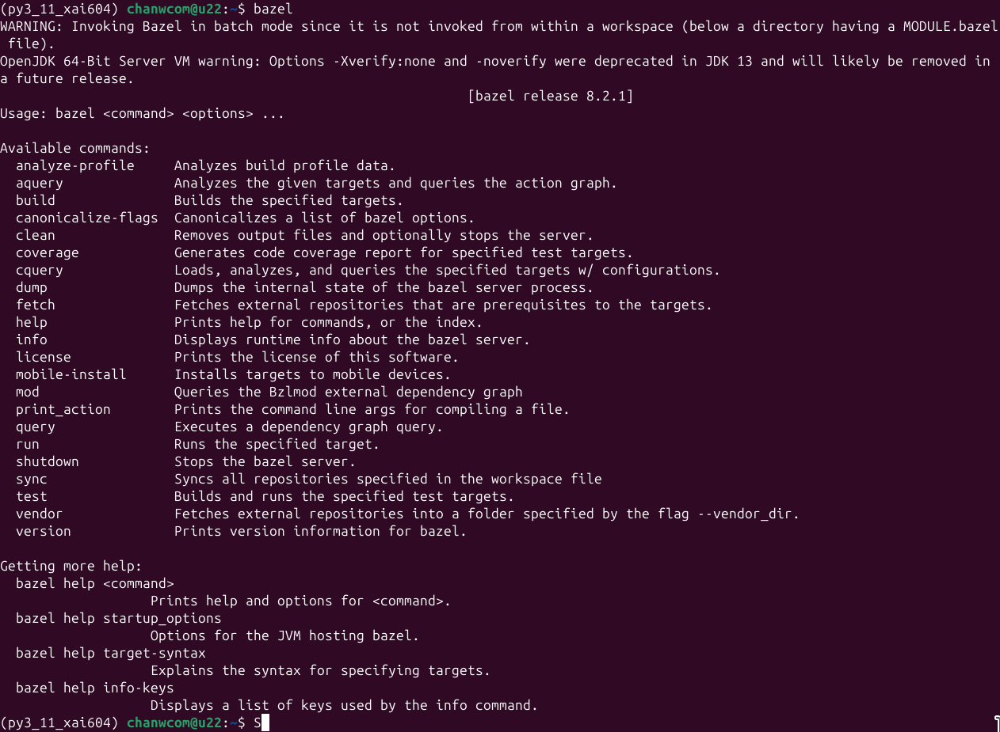

# Installing bazel with Tensorflow and PyTorch.

# 1. Creating a Personal Directory
First, we will a **personal bin** directory where bazel will be located, and will add this path to $PATH.

Create the **personal bin** directory by running the following command:
```
mkdir -p ~/bin
```
Include this **personal bin** directory to searchable path by adding the following lines in **.profile**. 
Often, it has been already added to $PATH, so if this is the case, then you may skip this step:
```
# set PATH so it includes user's private bin if it exists
 if [ -d "$HOME/bin" ] ; then
     PATH="$HOME/bin:$PATH"
 fi
```

# 2. Installing Bazel
Refer to the following page:
https://bazel.build/install

We recommend that you use Bazelisk on Linux Ubuntu.

Refer to the following page regarding the entire installation procedure:
https://github.com/bazelbuild/bazelisk


Download  **bazelisk** in mentioned in the above website.
More specifically, you may download **bazelisk-linux-amd64** from the following page to ~/bin:
https://github.com/bazelbuild/bazelisk/releases

Create a symbolic link by running the following command:
```
ln -s  ~/bin/bazelisk-linux-amd64 ~/bin/bazel
```

After everthing is done, go to any directory that is "~/bin", and run the following command:
```
bazel
```

If your scrren out is similar to the following screen shot, then **bazel** is installed correctly.
</img>

