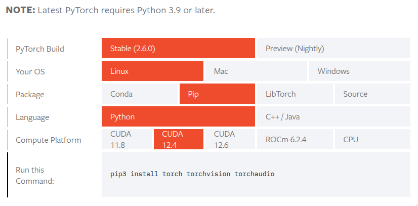

# Creating the Conda environment
## 1. Installing Conda
   
Refer to the following page.

https://docs.conda.io/projects/conda/en/stable/user-guide/install/linux.html

We recommend installing Miniconda instead of Anaconda, since Anaconda comes with many extra packages that you may not need.

About the Miniconda installation guide, please refer to the following page.

https://www.anaconda.com/docs/getting-started/miniconda/install#quickstart-install-instructions


## 2. Creating a Conda environment
e
Once Conda is installed, you may run the following command to create a Conda environment for this class.

```
conda create --name py3_12_xai604 python=3.12
```

Note that Tensorflow does not support Python 3.13 yet as of Apr. 2025.

## 3. Activating the Conda environment created just ago

```
conda activate py3_12_xai604
```

For more information about Conda, please refer to the following page:
https://docs.conda.io/en/latest/


Also, the following cheat sheet may be quite useful.
https://docs.conda.io/projects/conda/en/stable/user-guide/cheatsheet.html


## 4. Installing Pytorch and Tensorflow

Visit the following website to find information about installing PyTorch.

https://pytorch.org/get-started/locally/ 

You may check the CUDA version by running the following command.
```
nvidia-smi
```
You can find the latest CUDA version supported by the GPU driver in the upper right corner of the screen.
cf. Note that the version mentioned by nvidia-smi may be different from the version pointed by nvcc --version. You may install Pytorch based on "nvidia-smi".

Select the command at the bottom of the table, after seleting the right "Compute Platform" For example, if the CUDA version is 12.4, then run the following command: Note that torchdata is added.


</img>

As of Apri 2024, if we select CUDA version 12.4, Linux, Pip, then we may use the following command. 
```
pip3 install torch torchvision torchaudio
```


conda install pytorch torchvision torchaudio torchdata pytorch-cuda=11.8 -c pytorch -c nvidia
conda install tensorflow-cpu

Install HuggingFace Transformers and Datasets.
pip install transformers[torch] datasets

SoundFile installation
pip install soundfile

Librosa installtion
conda install -c conda-forge librosa

For speech recognition evaluation
pip install evaluate jiwer

Reference: https://huggingface.co/docs/datasets/v1.11.0/installation.html

## 4. Installing Tensorflow

Run the following comand
```
pip install tensorflow
```
To check whether it correctly uses the GPU, type the following command:
```
python3 -c "import tensorflow as tf; print(tf.config.list_physical_devices('GPU'))"
```


